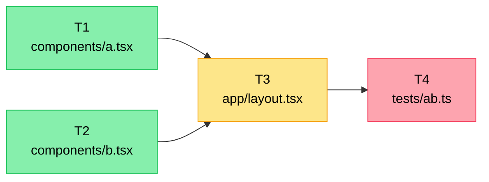

# 01. Planner DAG before parallelism

**Principle.** Before you spawn N parallel agents on a task, one agent (in a clean context) builds a dependency-annotated DAG of the subtasks. That DAG is the contract. No DAG, no parallelism.

## Why

Parallelism without a DAG is theater. Two agents working "in parallel" on the same feature inevitably touch the same files, make incompatible assumptions, or duplicate work. The wall-clock savings vanish in merge resolution — and worse, the bugs that survive into main are the kind that don't fire until something orthogonal triggers them three weeks later.

The DAG forces you to answer three questions before any agent starts work:

1. What are the actual subtasks?
2. Which subtasks depend on which?
3. Which files does each subtask own?

If you can't answer all three, the task isn't ready for parallel execution. Sequence it instead.

## Mechanism

Use a separate agent — different conversation, different context — as the planner. It reads the task and produces something like:

```
T1: scaffold component A    [files: components/a.tsx]           [deps: none]
T2: scaffold component B    [files: components/b.tsx]           [deps: none]
T3: wire A+B into layout    [files: app/layout.tsx]             [deps: T1, T2]
T4: integration test        [files: tests/integration/ab.ts]    [deps: T3]
```

T1 and T2 run in parallel — no shared files, no dependencies. T3 waits for both. T4 waits for T3.



Green nodes have no dependencies and can run immediately. Yellow waits on the green nodes. Red waits on yellow. Anything in the same color band can be spawned in parallel.

The planner runs cold so it isn't biased by the prior conversation. Use the same model you'd use for execution — there's no reason to downgrade here. Planning errors are an order of magnitude more expensive than execution errors.

## Anti-pattern

Spawning three workers with "you handle X, you handle Y, you handle Z" without verifying they share no files. The workers proceed, finish, and submit branches that all touch `lib/utils.ts`. You spend an hour rebasing and a second hour figuring out which version of the function was correct.

## Heuristic

If two subtasks list the same file in their "owned files" set, they are not parallel. Merge them, sequence them, or split the file.

## Related

- [02. One file, one owner](./02-one-file-one-owner.md) — the rule the DAG exists to enforce.
