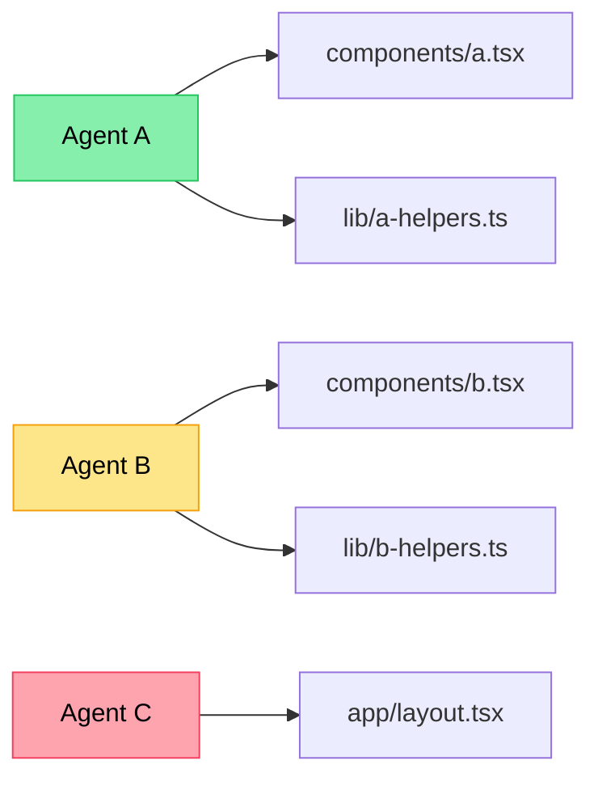

# 02. One file, one owner

**Principle.** For any given plan, each file has exactly one agent that's allowed to edit it. Two agents on the same file is a merge conflict you scheduled in advance.

## Why

Git is excellent at merging code where humans wrote different functions in the same file. Git is bad at merging code where two agents independently rewrote the same function with subtly different conventions. The kind of "merge" that produces:

```ts
<<<<<<< HEAD
const formatPrice = (cents: number) => `$${(cents / 100).toFixed(2)}`
=======
const formatPrice = (n: number) => `$${(n / 100).toFixed(2)}`
>>>>>>> branch-b
```

— is technically resolvable, but you've now also got a `formatPrice` callsite that passes `cents` and another that passes `n`, and they both worked locally, and one of them is wrong in production.

The rule eliminates the entire class of problem.

## Mechanism



Every file has exactly one inbound arrow. If you can't draw the diagram this cleanly, the plan isn't ready.

Two reinforcing layers:

1. **At plan time** — the [DAG](./01-planner-dag.md) lists owned files per subtask. If a file appears in two subtask owner-sets, that's a planning error and you fix it before any work starts.
2. **At execution time** — each agent works in its own [git worktree](https://git-scm.com/docs/git-worktree), branch named after the subtask. The branch protection is physical, not just conventional.

When two agents genuinely *need* to touch the same file, you have three options:

- **Sequence them.** Agent A finishes and commits, then agent B starts.
- **Split the file.** Maybe the file was doing too much anyway.
- **Have one agent do both.** The "parallelism" you were buying was probably worth less than the coordination cost.

## Anti-pattern

The most seductive failure: "they're only touching different sections of the file, it'll merge cleanly." It usually does merge cleanly. It also produces code that no single agent has ever read end-to-end, which is how invariants quietly break.

## Heuristic

If you can't draw the file ownership on a napkin, you don't have a plan. Don't spawn workers yet.

## Related

- [01. Planner DAG before parallelism](./01-planner-dag.md) — where the ownership map lives.
