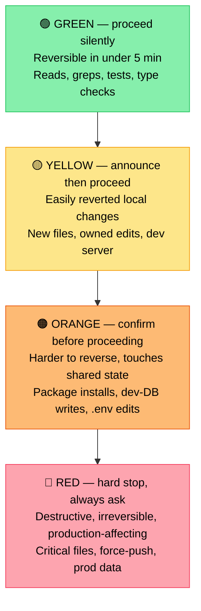

# 06. Autonomy gradient

**Principle.** Not every action deserves the same level of trust. Match the autonomy you grant an agent to the blast radius of the action it's about to take.

## Why

Asking permission for every action is exhausting and makes agentic work pointless. Asking permission for *no* actions is how production breaks. The right answer is a gradient: fast on reversible work, slow on irreversible work, hard stops on a small set of categorically dangerous actions.

The gradient I use has four levels.

## The four levels

### Green — proceed silently
The action is reversible in under five minutes and affects only the local workspace.

- Reading files
- Running grep / search / find
- Running tests
- Running type checks and linters
- Read-only API calls

Don't even narrate these. Just do them.

### Yellow — announce, then proceed
The action changes local state but is easily reverted.

- Creating new files
- Editing files the agent owns in the current plan
- Creating a branch
- Starting a local dev server

One-line announcement before the action: "Creating `components/foo.tsx` with the layout we discussed." Then go.

### Orange — confirm before proceeding
The action is harder to reverse or touches shared state.

- Editing files outside the plan's owned set
- Installing or upgrading dependencies
- Database writes (even in dev)
- Any edit to `.env.*` files

Explicit confirmation: "About to add `react-query` to package.json — okay?" Wait for yes.

### Red — hard stop, always ask
The action is destructive, irreversible, or production-affecting. No autonomy gradient negotiates these. Always ask.

- Edits to [critical files](./05-critical-file-safeguards.md): auth middleware, payment handlers, migrations
- `git push --force`, `git reset --hard`
- Any edit to a production environment variable
- Any write to a payment processor
- Domain / DNS changes
- Deletes of more than 50 lines from any file

## Mechanism

The gradient lives in two places:

1. **Project instructions** — a CLAUDE.md (or equivalent) that names which files are red, which directories are orange, etc.
2. **Hooks** — runtime guards that intercept tool calls and require approval for red/orange actions even if the agent forgot. Belt and suspenders.

## Anti-pattern

The single-bit "autopilot on / autopilot off" toggle. It collapses the gradient into a binary, which means either you're answering "yes" to every trivial action or you're letting the agent push to production. The gradient exists because reality has more than two levels.

## Heuristic

Before any action, ask: "If this turns out to be wrong, how long to recover?"
- Under five minutes → green.
- Same session → yellow.
- Same day → orange.
- Could affect production or customers → red.

If you can't answer the question, the action is at least orange. Confirm.

## Related

- [05. Critical-file safeguards](./05-critical-file-safeguards.md) — the red end of the gradient, in detail.
